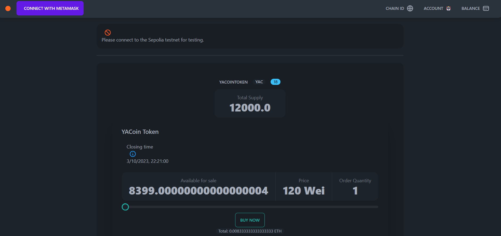
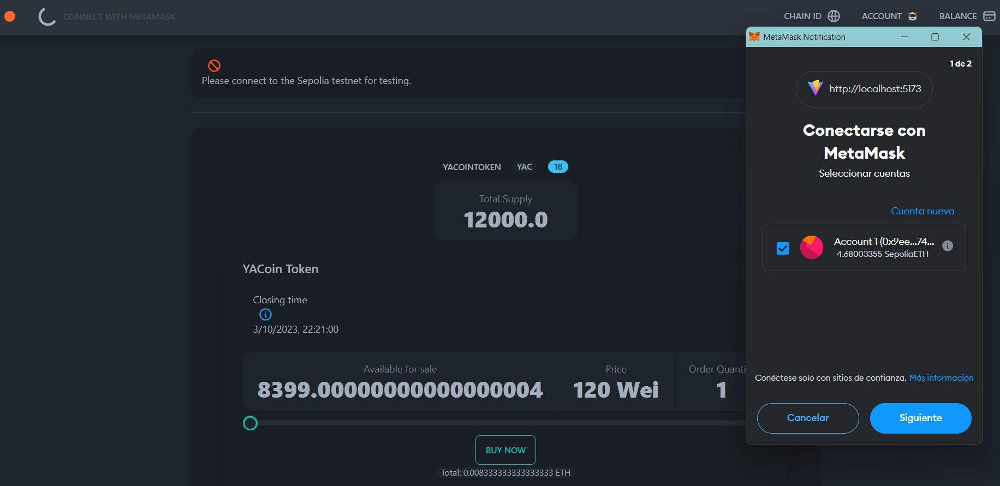
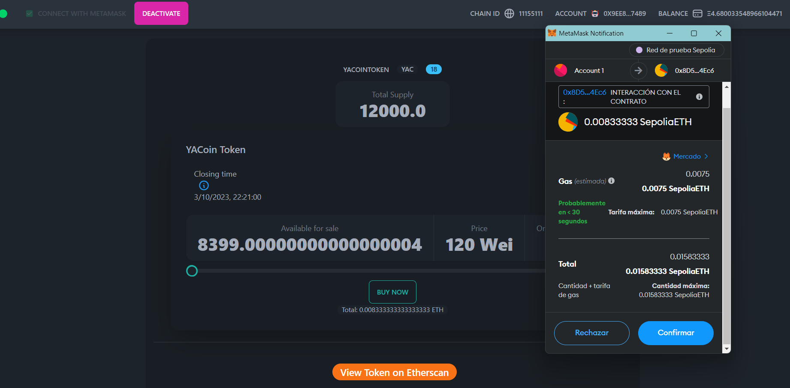

# ICO Contract YAC Token 🪙


El objetivo general es desarrollar un contrato inteligente para una Oferta Inicial de Monedas (ICO, por sus siglas en inglés) con el objetivo de recaudar 100 Sepolia-ETH. Además, crear una interfaz de usuario simple para interactuar con el contrato.


## Link
Adquiere tus Yacoin desde [aquí.](https://tech-p-ico.vercel.app/)

Para poder compartir la página, se utilizó [Vercel.](https://vercel.com/) 


## Prerequisitos

- Haber configurado una Wallet en Metamask.
- Tener Node.js installado. Si no, descarguelo [aquí.](https://nodejs.org/en/download)

Empecemos!

## Requerimientos
- Nombre del Token: A elección del alumno (Ejemplo: Yacoin Token)
- Símbolo del Token: Tres letras mayúsculas (Ejemplo: YAC)
- Decimales: 18
- Duración de la ICO: 7 días
- Valor del Token: El valor del token en Sepolia-ETH estará determinado por el mes de nacimiento del dueño de la ICO multiplicado por 10. 
- Contrato ICO en Solidity

El contrato debe permitir que cualquier usuario participe en la ICO transfiriendo Sepolia-ETH.
Los tokens adquiridos deben ser entregados al inversor una vez que finalice la ICO.

## ICO Contracts deployed en Sepolia Tesnet

- YACoinToken (YAC) - https://sepolia.etherscan.io/token/0x748901e0246d703a7000357bdde7f7a93cacac96

- Contract - https://sepolia.etherscan.io/address/0x8d5462f0b88f773ca0a8b2ea85faa8a081dd4ec6

## Ejecutar el cliente

- Para desarrollar el sitio web se usó [React](https://reactjs.org/) y [Vite Js](https://es.vitejs.dev/guide/). React es un marco de JavaScript que se utiliza para crear sitios web y Vite es una herramienta de tooling para el Frontend.

```sh
$ npm yarn dev

yarn run v1.22.19
vite

  VITE v4.4.9  ready in 613 ms

  ➜  Local:   http://localhost:5173/
  ➜  Network: use --host to expose
  ➜  press h to show help
```

# Pruebas de Ejecución

## Cliente



### Conectarse a MetaMask



### Comprar Yacoin tokens
Compre con Metamaskk y espere la confirmación.



# Configuración del ICO Contract

## Recursos

- ⚡️ React TypeScript template with [Vite 2](https://vitejs.dev/)
- 📦 [Hardhat](https://hardhat.org/) - Ethereum development environment for professionals
- 🦾 [TypeChain Hardhat plugin](https://github.com/ethereum-ts/TypeChain/tree/master/packages/hardhat) - Automatically generate TypeScript bindings for smartcontracts while using Hardhat.
- 🔥 [web3-react](https://github.com/NoahZinsmeister/web3-react/) - A simple, maximally extensible, dependency minimized framework for building modern Ethereum dApps
- 🎨 [daisyUI Tailwind CSS Components](https://daisyui.com/) - clean HTML with component classes
- 🎨 [OpenZeppelin](https://docs.openzeppelin.com/contracts/4.x/) - standard for secure blockchain applications


## Install

```sh
npm yarn install
```

Para construir el contrato inteligente se usará [Hardhat](https://hardhat.org/). Hardhat es un entorno y marco de desarrollo de Ethereum diseñado para el desarrollo completo en Solidity. En palabras simples, puede escribir su contrato inteligente, implementarlo, ejecutar pruebas y depurar su código.

- Para configurar un proyecto Hardhat, abra una terminal y ejecute estos comandos

```bash
  mkdir smart-contract
  cd smart-contract
  npm init --yes
  npm install --save-dev hardhat
```
- En el mismo directorio donde instaló Hardhat ejecute:

```bash
  npx hardhat
```

  - Select `Create a Javascript project`
  - Press enter for the already specified `Hardhat Project root`
  - Press enter for the question on if you want to add a `.gitignore`
  - Press enter for `Do you want to install this sample project's dependencies with npm (@nomicfoundation/hardhat-toolbox)?`

Listo!

Si está en Windows, realice este paso adicional e instale estas bibliotecas también :)

```bash
npm install --save-dev @nomicfoundation/hardhat-toolbox
```

y presione `Enter` para todas las preguntas.

- En la terminal, ahora instale `@openzeppelin/contracts` ya que se importará el contrato [Openzeppelin's ERC721Enumerable Contract](https://github.com/OpenZeppelin/openzeppelin-contracts/blob/master/contracts/token/ERC721/extensions/ERC721Enumerable.sol).

```bash
  npm install @openzeppelin/contracts
```

## ICO Token
- Envie algo de SepoliaETH a su wallet https://sepolia-faucet.pk910.de/

Cree un archivo .env similar al .env.example que se encuentra en el root del directorio. Recuerde cambiar los valores que se indican.

```
ETHERSCAN_API_KEY=<YOUR ETHERSCAN API KEY>
SEPOLIA_PROVIDER_URL=https://sepolia.infura.io/v3/<YOUR ALCHEMY KEY>

PRIVATE_KEY=<YOUR PRIVATE KEY>
VITE_CROWDSALE_ADDRESS=<YOUR DEPLOYED SMART CONTRACT ADDRESS>
VITE_PROVIDER_URL=https://sepolia.infura.io/v3/<YOUR ALCHEMY KEY>
```

## Compile los archivos
```sh
$ npx hardhat compile
Compiling...
Successfully generated 18 typings!
Successfully generated 18 typings for external artifacts!
```

## Deploy

Luego, lance el contrato en la red de Sepolia.

```sh
npx hardhat run scripts/deploy_yacointokencrowdsale.js --network sepolia
```

Output:

```
YACoinToken deployed to: 0x748901e0246D703A7000357bdDe7F7a93CaCac96
Name YACoinToken
Symbol YAC
Decimals 18
Total Supply BigNumber { value: "12000000000000000000000" }
Owner 0x9Ee8465d8a53090be1f92137a45219c8EC4e7489
openingTime 1695788460
closeTime 1696393260
YACoinTokenCrowdsale deployed to: 0x8D5462F0b88f773ca0A8B2Ea85Faa8a081dD4Ec6

```

Verifique el token del Yacoin Token

```sh
npx hardhat verify --network sepolia 0x748901e0246D703A7000357bdDe7F7a93CaCac96
```

Output:

```
Nothing to compile
Generating typings for: 0 artifacts in dir: src/types for target: ethers-v5
Successfully generated 18 typings!
Successfully generated 18 typings for external artifacts!
Successfully submitted source code for contract
contracts/YACoinToken.sol:YACoinToken at 0x748901e0246D703A7000357bdDe7F7a93CaCac96
for verification on the block explorer. Waiting for verification result...

Successfully verified contract YACoinToken on Etherscan.
https://sepolia.etherscan.io/address/0x748901e0246D703A7000357bdDe7F7a93CaCac96#code
```

Finalmente, verifique el Yancoin Token Crowdsale

```sh
npx hardhat verify --network sepolia 0x8D5462F0b88f773ca0A8B2Ea85Faa8a081dD4Ec6 120 0x9Ee8465d8a53090be1f92137a45219c8EC4e7489 0x748901e0246D703A7000357bdDe7F7a93CaCac96 0x9Ee8465d8a53090be1f92137a45219c8EC4e7489 1695788460 1696393260
```

Output:

```
Nothing to compile
Generating typings for: 0 artifacts in dir: src/types for target: ethers-v5
Successfully generated 18 typings!
Successfully generated 18 typings for external artifacts!
Warning: This declaration shadows an existing declaration.

... some warnings 

Successfully submitted source code for contract
contracts/YACoinTokenCrowdsale.sol:YACoinTokenCrowdsale at 0x8D5462F0b88f773ca0A8B2Ea85Faa8a081dD4Ec6
for verification on the block explorer. Waiting for verification result...

Successfully verified contract YACoinTokenCrowdsale on Etherscan.
https://sepolia.etherscan.io/address/0x8D5462F0b88f773ca0A8B2Ea85Faa8a081dD4Ec6#code
```

## Etherscan verification

Para probar la verificación de Etherscan, primero debe implementar un contrato en una red Ethereum compatible con Etherscan, como Sepolia.

En este proyecto, copie el archivo .env.example a un archivo llamado .env y luego edítelo para completar los detalles. Ingrese su clave API de Etherscan, la URL de su nodo Ropsten (por ejemplo, de Alchemy) y la clave privada de la cuenta que enviará la transacción de implementación. Con un archivo .env válido, primero implemente su contrato:

```shell
npx hardhat run --network sepolia scripts/deploy_greeter.js
```

Luego, copie la dirección de implementación y péguela para reemplazar `DEPLOYED_CONTRACT_ADDRESS` en este comando:

```shell
npx hardhat verify --network sepolia DEPLOYED_CONTRACT_ADDRESS "Hello, Hardhat!"
```

### FIN